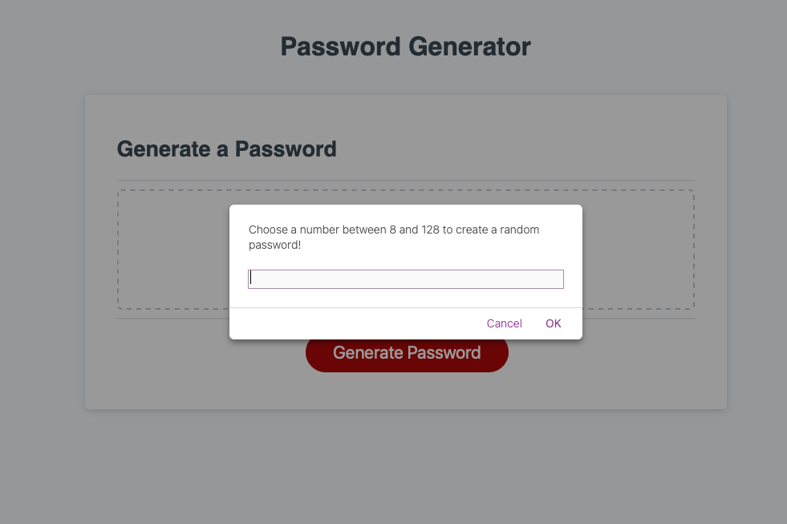
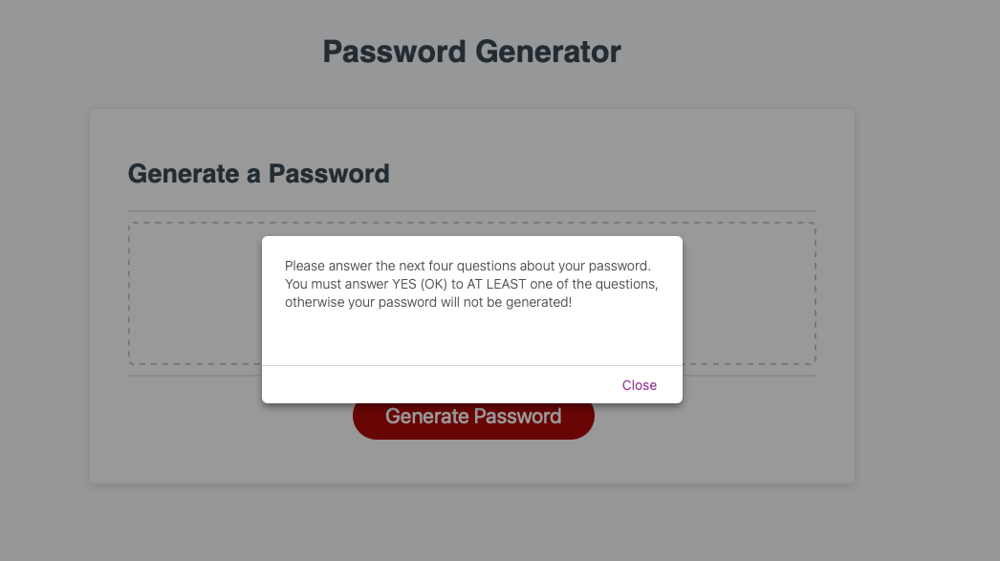
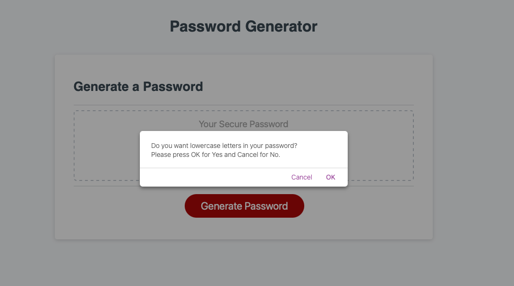
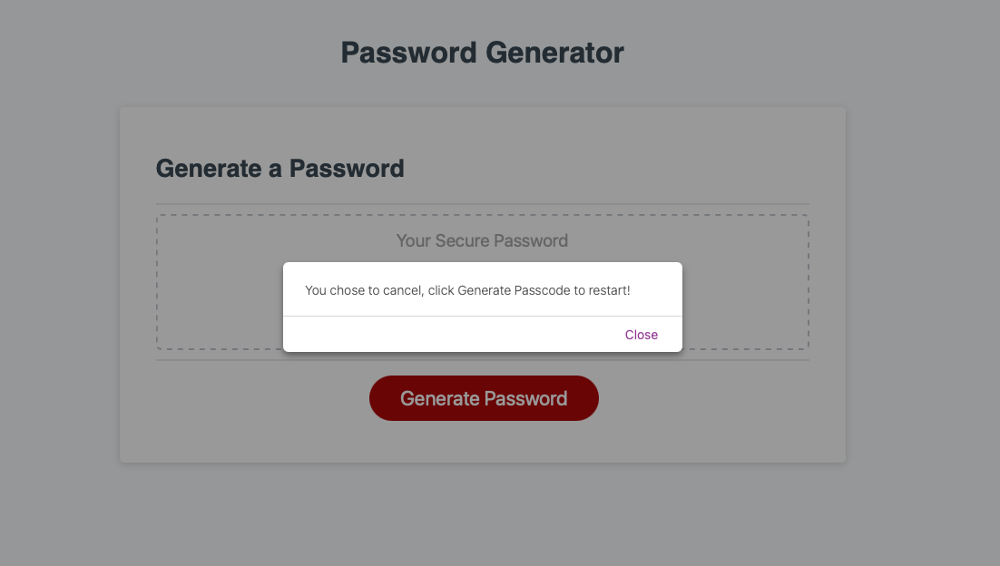
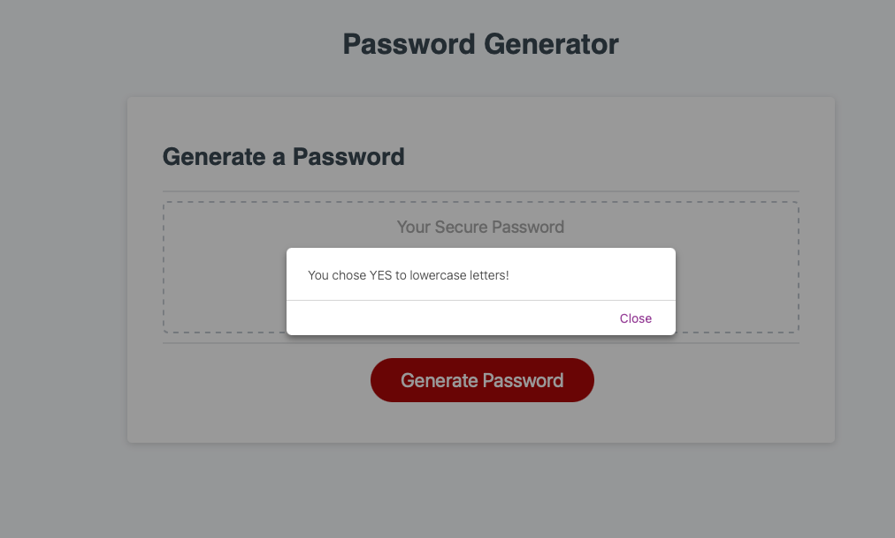
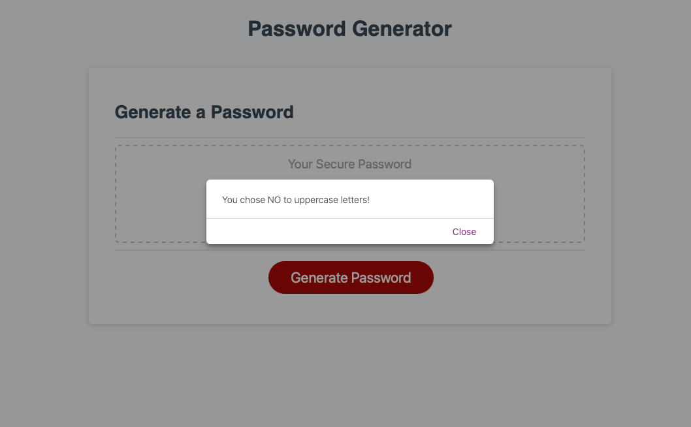
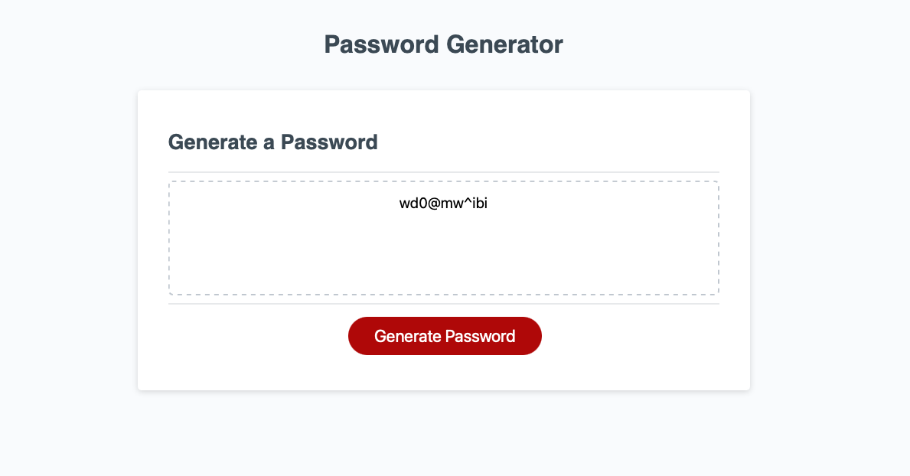

# Random-Password-Generator

## Project Description

A password generator designed to allow the user the ability to create a random password after answering a series of questions referring to what should be included.

## Table of Contents 

- [About the Project](#about-the-project)
- [Installation](#installation)
- [Usage](#usage)
- [Credit](#credit)
- [License](#license)

## About the Project

- This project was built to provide users the ability to create a random password that could include a variety of characters.
- The motiviation for this project was to utilize Javascript to create a random password based on user inputs based on questions provided.
- Prompts have been added for user to input character preferences for their password.
- Alerts have been added to notify the user of the choices they have made through each question.
- Comments have been added to the Javascript file to make any future changes easier.
- User is able to create a random password as many times as needed as long as the one of the four options is chosen.

## Installation

- Open [Random Password Generator](incliude link to web page) 
- Or, open index.html in your internet browser.

## Usage

- Click the Generate Passcode button to answer a series of questions and create a random password.

About Section \
Password Length Prompt \
 \
\
Question Alert and Warning \
 \
\
Lowercase Letters Question \
 \
\
User Choice Alerts \
 \
 \
 \
\
Random Password Generated to Screen \
 

## Credit

- HTML and CSS provided along with a few lines of Javascript.

## License

- No license for this project.